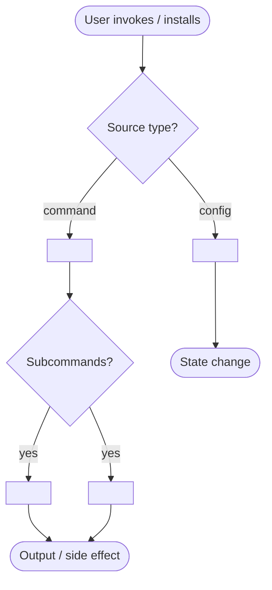

# Source-to-Skill Converter

Source: $ARGUMENTS

Convert any source into a best-fit SKILL.md — no interview required. The source drives everything: its type, language, and patterns determine skill shape, degree-of-freedom, and trigger phrases.

## Source Types & Routes

| Type | Signals | Route |
|------|---------|-------|
| **script** | `.sh`, `.py`, `.js`, `.rb` file; `#!/` shebang; CLI flags visible | steps below |
| **repo** | GitHub/GitLab URL; `README.md` + source tree | steps below |
| **api-docs** | OpenAPI/Swagger URL; doc site with endpoints; `/api/`, `/v1/` paths | steps below |
| **arxiv** | arxiv.org URL (abs or pdf) | context-mode fetch + AST parse — see Step 1 |
| **paper** | non-arXiv PDF with abstract+introduction; ACM/IEEE URL | multi-section pipeline — see Step 1 |
| **book** | PDF/EPUB/DOCX/HTML/RTF/MOBI/AZW; a whole book or multi-chapter reference work with a table of contents | **Book Route** (knowledge-base output) — see below |
| **doc site** | multi-subsection docs site; sidebar nav with 10+ pages; versioned URL paths | multi-section pipeline — see Step 1 |
| **short doc / page** | URL or text ≤ 20 pages; reference page, how-to guide | steps below |

A **book** differs from a *paper* or *doc site*: it has crystallized, chaptered expertise (frameworks, mental models, anti-patterns) and is best captured as an on-demand **knowledge-base skill** (`SKILL.md` + `chapters/` + `glossary` + `patterns` + `cheatsheet`), not a single workflow/reference skill. When the source is book-shaped, skip Steps 1–7 and follow the **Book Route**.

## Step 0 — Classify source

Identify the source type from `$ARGUMENTS`. Run `scripts/classify-source.sh "$ARGUMENTS"` if available. If ambiguous, ask one question: "Is this (1) a script/CLI tool, (2) a GitHub repo, (3) an API/docs page, (4) a short article/guide, or (5) a book / long multi-chapter document?" Derive a domain slug (e.g. `kubectl`, `stripe-api`, `jq`) — this drives the research queries in Step 2. Offer two slug options when the choice is non-obvious: `{tool-name}` (e.g. `stripe-api`) vs `{action-concept}` (e.g. `payment-intents`); let the user pick or default to `{tool-name}`. See [examples/](examples/) for GOOD/BAD output targets before proceeding.

**If the source classifies as `book`, go straight to the [Book Route](#book-route--knowledge-base-skills) — the steps below are for tool/script/API/repo/short-doc sources.**

**Analyze-only mode:** If `$ARGUMENTS` contains `--analyze`, `analyze`, `just extract`, or `show me first`, run Steps 0–3 only and emit the source-analyst report (Book Route: run its Steps B0–B3 only). Do not proceed to drafting until the user explicitly says "generate", "go", or "y".

## Step 1 — Fetch & read source

| Type | How to read |
|------|-------------|
| arXiv URL | context-mode fetch + markdown AST parse — see arXiv pipeline below |
| PDF (local or URL) | context-sensitive extraction — see below |
| Local non-PDF file | `Read` the file |
| URL (docs/article) | `WebFetch` the URL |
| GitHub repo | Fetch README + scan file tree; read key files (Makefile, setup.py, main entry point) |
| Script | Read the file; run `--help` or `-h` if executable |

**arXiv pipeline:** For any arxiv.org URL (abs or pdf form), run this sequence: (1) Fetch with `mcp__plugin_context-mode_context-mode__ctx_fetch_and_index` using the abs URL (e.g. `https://arxiv.org/abs/XXXX.XXXXX`) — context-mode retrieves the HTML-rendered version as clean markdown and indexes it. (2) Parse the indexed markdown with `mcp__codemode__ast` to extract the section tree: abstract, introduction, methods/approach, experiments/evaluation, results, discussion, conclusion. (3) For each section, produce a two-field annotation: `functionality` (what capability, technique, or mechanism this section describes that an agent could use) and `result_contribution` (does this section directly support the paper's main claims? rate: `core` / `supporting` / `background` / `none`). (4) Build a section map — a table of `section | functionality | result_contribution` — before reading any section in depth. (5) Load only `core` and `supporting` sections into context for pattern extraction. Skip `background` and `none` sections unless a specific concept is needed. See [references/arxiv-parsing.md](references/arxiv-parsing.md) for the full AST traversal approach.

**PDF extraction (context-sensitive):** Run `scripts/extract-pdf.sh <file> auto` which auto-detects content type and picks the right tool (Docling for technical, pdftotext for prose, pypdf as fallback). See [references/pdf-tools.md](references/pdf-tools.md) for tool installation and manual commands. After extraction, grep for section headings to build a lightweight structure map before reading the full output — for docs over 20k tokens, read only the sections relevant to the domain slug. *(For a whole book, prefer the Book Route's `scripts/extract.py`, which handles EPUB/DOCX/MOBI and emits chapter-aware metadata.)*

**Multi-section pipeline (paper / doc site):** Do not load the full source. (1) Build a section inventory first: for PDFs use `grep -n "^#\|^[A-Z][A-Z ]\{4,\}" extracted.txt | head -40`; for doc sites fetch the index/nav page and collect all subsection URLs. (2) Annotate each section/page with `functionality` (what it describes that an agent could use) and `result_contribution` (`core` / `supporting` / `background` / `none`) — same schema as the arXiv pipeline. (3) Load only `core` sections in full; use `ctx_search` for targeted lookup in `supporting` sections; skip `background` and `none`. (4) For doc sites with 10+ pages, cap deep-reads at 8 pages max — pick the pages that appear most in search results and GitHub issues for the domain. (5) Produce a section map table before any extraction. See [references/arxiv-parsing.md](references/arxiv-parsing.md) for the full annotation schema (applies equally to non-arXiv long-form sources).

For large sources (>50k tokens), use targeted reads: grep for commands, flags, and function signatures — don't load the full file.

## Step 2 — Research: find best-in-class examples

Run these searches in parallel using the domain slug from Step 0. The goal is to cherry-pick proven patterns and techniques before writing the skill — not to clone what exists, but to steal the best ideas holistically.

**GitHub repos (proof-of-value signal: stars + recency):**
```bash
gh search repos "<domain-slug>" --sort stars --limit 8 --json nameWithOwner,description,stargazerCount,updatedAt
gh search repos "<domain-slug> cli" --sort stars --limit 5 --json nameWithOwner,description,stargazerCount
```

**Existing skills and plugins (skills.sh + awesome lists):**
```bash
/search-web "site:skills.sh <domain-slug> skill" OR "<domain-slug> claude code skill SKILL.md"
/search-web "awesome <domain-slug> cli tools productivity"
# also: mcp__codemode__web_search with the same queries for broader coverage
# mcp__codemode__research is available for shallow domain orientation — keep depth=1 or equivalent; do NOT do a full deep crawl
```

**MCPs relevant to the domain:**
```bash
/search-web "mcp server <domain-slug> model context protocol"
gh search repos "mcp <domain-slug>" --sort stars --limit 5 --json nameWithOwner,description,stargazerCount
```

### Step 2b — Profile each resource before cherry-picking

For **every resource fetched** above (each repo README, skills page, MCP listing, doc page), produce a resource profile in this format before pulling anything from it:

````
### Resource: <name> (<url>) ★<stars>



**What it is:** <one paragraph — what this resource does, who built it, what problem it solves, and what makes it distinctive vs. others in the domain>

**Best insights for our use case:**
- <most transferable technique or pattern — specific, not generic>
- <second insight>
- <third insight>
- <skip if fewer than 3 genuine insights — do not pad>
````

Drop any resource that cannot produce at least 2 genuine insights. After profiling all resources, summarize into a 5–10 bullet "inspiration list" of the best cross-resource findings. Drop any find with <50 stars or last commit >12 months unless it's the only example in the domain.

## Step 3 — Extract patterns

Spawn the `source-to-skill:source-analyst` agent (defined in `agents/source-analyst.md` — copy to `~/.claude/agents/` to activate) with the source content and inspiration list. If the agent is not installed, extract manually. Four signal categories:

**Commands & invocations** — every CLI flag, subcommand, environment variable, and example invocation. Preserve exact syntax. Prioritize the invocations that appear most in research finds — those are the ones users actually reach for.

**Workflows** — ordered sequences the user repeats. Name each workflow using the terminology the top-starred repos use, not invented names.

**Terminology** — domain-specific terms with precise definitions. Cross-check against research finds; terms that appear across multiple sources become the strongest trigger phrases.

**Error patterns** — common failure modes, diagnostic steps, known workarounds. Mines are most valuable: grep research repo issues for recurring error strings.

For API docs, also extract: authentication pattern, rate limits, key endpoints with request/response shapes.

## Step 4 — Fit-map

Choose skill shape based on extracted patterns:

| Pattern mix | Skill shape | Degree of freedom |
|-------------|-------------|-------------------|
| Mostly commands + flags | workflow skill — steps with literal commands | **low** — script the exact commands |
| Workflows + some flexibility | workflow skill with decision points | **medium** — pseudocode + parameters |
| Frameworks + mental models | reference skill — principles + indexed concepts | **high** — text-based heuristics |
| API with many endpoints | integration skill — endpoint index + auth + examples | **medium** |
| Book / multi-chapter reference work | knowledge-base skill — `SKILL.md` + `chapters/` + glossary + patterns + cheatsheet | **high** — on-demand chapter loading |
| Mixed | hybrid — workflow core + reference sidebar | **medium** |

If the source is a **book**, the fit-map is already decided — use the knowledge-base shape via the **Book Route**.

If a relevant MCP was found in Step 2, note it: `MCP available: <name> — add to allowed-tools if installed.` For non-obvious cases, see [references/fit-mapping.md](references/fit-mapping.md) for edge cases and the full decision tree.

Output one line: `Shape: <shape> | Freedom: <level> | Why: <one reason>`

## Step 5 — Synthesize triggers

Derive trigger phrases from the source's own language and the research finds — not invented descriptions. Pull the 3–6 most distinctive terms/commands that appear across both the source and the top research repos. Write a description that names what the skill enables (sentence 1) and lists the trigger terms verbatim: "Use when user mentions `<term1>`, `<term2>`, or asks to `<command>`" (sentence 2). See [references/trigger-synthesis.md](references/trigger-synthesis.md) for the three-tier extraction method and cross-trigger validation test.

## Step 6 — Draft

**Fold-in check:** Before drafting, run `ls ~/.claude/skills/<slug>/SKILL.md 2>/dev/null`. If the skill already exists, ask: "A skill named `<slug>` already exists — merge new content in (fold-in), overwrite, or rename to `<slug>-2`?" Wait for answer before proceeding. For fold-in: read the existing SKILL.md, identify what the new source adds that isn't already covered, and merge only the delta — don't regenerate content that's already correct.

Write `SKILL.md` using the shape from Step 4, with techniques borrowed from the best research finds. Structure:

```markdown
---
name: <slug-from-source-name>
description: "<synthesized from Step 5>"
---

# <Source Name>

## Quick start
<minimal working example — the first thing a user needs, validated against top research repos>

## Workflows
<named workflows using the terminology that top-starred repos use>

## Reference
<commands / flags / endpoints — only what Steps 3+2 found, no padding>
```

Add bundled resources only when they earn their cost:
- `scripts/` — if the source has runnable commands repeated verbatim
- `references/` — if the API endpoint list or term glossary exceeds ~80 lines

Keep `SKILL.md` body under 150 lines. Move overflow to `references/`.

## Step 7 — Critique & confirm

**Pre-flight estimate:** Before writing any files, run `wc -w <extracted-source-file>` on the extracted source content and show: `Source: ~<N> words (~<N/0.75> tokens) | Estimated skill output: ~<lines>L / ~<tokens>T | Write to ~/.claude/skills/<slug>/SKILL.md? [y/n]"`. Wait for confirmation before writing.

Before showing the draft to the user, spawn the `source-to-skill:skill-critic` agent (defined in `agents/skill-critic.md` — copy to `~/.claude/agents/` to activate) against the draft. If any criterion FAILs, fix it before proceeding. If the agent is not installed, self-review against the 10 criteria in that file.

Show the passing draft and the inspiration list. Ask: "Shape: `<shape>` | Freedom: `<level>` | Borrowed from: `<repo1>`, `<repo2>` | Triggers: `<term1>`, `<term2>`, `<term3>` — ready to write to `~/.claude/skills/<slug>/SKILL.md`? [y / tweak: <notes> / rename: <slug>]"

Write only after confirmation.

---

# Book Route — knowledge-base skills

Use this route when Step 0 classifies the source as a **book** or multi-chapter document. It produces a *knowledge-base skill*: a thin `SKILL.md` index over on-demand `chapters/` files, plus a glossary, patterns, and cheatsheet. The goal is to **extract structure, not summaries** — named frameworks, exact formulations, anti-patterns — never a book report.

> The extraction engine (`scripts/extract.py` + `scripts/extractor/`) and this pipeline are adapted from the standalone **book-to-skill** skill, embedded here as the `book` source type. See `scripts/extractor/LICENSE.md` for its license.

Supported formats: `.pdf`, `.epub`, `.docx`, `.txt`, `.md`, `.markdown`, `.rst`, `.adoc`, `.html`, `.htm`, `.rtf`, `.mobi`, `.azw`, `.azw3` (MOBI/AZW need Calibre).

### Step B0 — Validate input

Identify the input path(s)/glob and an optional skill-name slug from `$ARGUMENTS`. If the last argument isn't an existing file/folder/glob but looks like a slug (lowercase-hyphens), treat it as `SKILL_NAME`; everything else is `INPUT_PATHS`. Expand directories/globs to supported files. If none match, stop with a clear error.

### Step B1 — Identify content type

Ask once: "Is this content (1) **technical** — code, tables, formulas, diagrams; or (2) **text-heavy** — mostly prose? (3) Not sure → I'll use the fast method." Map 1→`BOOK_TYPE=technical` (Docling, structure-aware, ~1.5s/page), 2 or 3→`BOOK_TYPE=text` (fastest suitable extractor). Tell the user which mode you picked and the rough time cost before running.

### Step B2 — Extract text

```bash
"${PYTHON_BIN:-python3}" scripts/extract.py $INPUT_PATHS --mode <BOOK_TYPE> --install-missing ask
```

The script checks optional per-format Python packages and prompts before installing; non-interactive sessions fall back unless `--install-missing yes`. It writes `<tempdir>/book_skill_work/full_text.txt` (combined text with source boundaries) and `metadata.json` (pages, words, token counts, per-source list). Read `metadata.json` to inspect results.

### Step B2.5 — Pre-flight cost estimate

Before any generation, present an estimate from `metadata.json`:
- Input tokens ≈ `estimated_tokens` × 1.3 (per-chapter prompt overhead)
- Output tokens ≈ chapters × 1,000 + 4,000 (SKILL.md) + 4,500 (glossary + patterns + cheatsheet)
- Show pages/words/tokens, estimated cost, files to be generated, and `➡ Proceed? (or "analyze only")`. Wait for confirmation. "analyze only" → run B0–B3 and stop with an extraction report.

### Step B2.6 — REPL-style access for large books (>50k tokens)

Do not `Read(full_text.txt)` unbounded — treat it as a queryable corpus. A 200-page book is ~75k tokens; re-reading it once per chapter would cost millions of tokens. Probe instead:

```bash
wc -w "$FULL_TEXT_PATH"
grep -n -E "^\s*(Chapter|CHAPTER|PART)\s+[0-9IVX]+" "$FULL_TEXT_PATH" | head -40   # chapter offsets
sed -n '<start>,<end>p' "$FULL_TEXT_PATH"                                          # pull one chapter
grep -c -i "<framework>" "$FULL_TEXT_PATH"                                          # verify before claiming
```

Use this for B3, B5, and B6. Under 50k tokens, a single `Read` is fine.

### Step B3 — Analyze structure

Read the first ~8k characters to get title, author(s), chapter structure, core themes, and approximate chapter count; read the table of contents if present to map all chapters. **Analyze-only mode stops here** with an extraction report (Author's Core Frameworks / Key Principles / Techniques / Anti-patterns / Suggested Skill Name / Chapters Detected table).

### Step B4 — Purpose & name

Ask what the skill should help the user do (apply frameworks / think with the author's models / reference chapters / all). Then choose a slug: `{author-lastname}-{core-concept}` (e.g. `cialdini-influence`) or title-based (e.g. `designing-data-intensive-apps`); default to author-concept for books with a strong methodological identity. Set `SKILLS_HOME` (default `~/.claude/skills`). If `<slug>/` exists, offer fold-in / overwrite / rename.

### Step B5 — Generate chapter summaries

`mkdir -p "$SKILLS_HOME/<slug>/chapters"`. For each chapter, pull its slice (REPL-style) and write `chapters/ch<NN>-<slug>.md` at **800–1,200 tokens**, dense not verbose. Sections: Core Idea · Frameworks Introduced (preserve exact author naming + when/how) · Key Concepts · Mental Models ("Use X when Y") · Anti-patterns · Code Examples & Reference Tables *(technical only — omit for `text`)* · Key Takeaways · Connects To. Adapt emphasis by `BOOK_TYPE`.

### Step B6 — Supporting files

- `glossary.md` — every significant term, alphabetized, `**Term** — definition (Ch N)`, ≤1,500 tokens
- `patterns.md` — concrete techniques/patterns, `## Name` + When/How/Trade-offs, ≤2,000 tokens
- `cheatsheet.md` — decision tables and quick-reference rules, the single-page version, ≤1,000 tokens

### Step B7 — Master SKILL.md

Keep the body **under 4,000 tokens**; compaction truncates from the end, so front-load. Structure: frontmatter (`name`, knowledge-base `description` naming the author + 3–6 key topics, `allowed-tools: [Read, Grep]`, `argument-hint`); a "How to Use" block (no args → core frameworks; topic → find + read the chapter; `chNN` → load that chapter; "what chapters?" → index); **Core Frameworks & Mental Models** (~2,000 tokens, exact names, toolkit voice); a **Chapter Index** table linking `chapters/`; a **Topic Index** (alphabetical term → chapter); a **Supporting Files** list; and a short **Scope & Limits**.

### Step B8 — Fold-in (existing book skill)

If updating an existing skill: read its SKILL.md (Chapter Index, Topic Index, metadata, Core Frameworks) and find the highest `chNN`. Classify new content as revisions (merge into existing chapter files) vs additions (new `chNN+` files). Merge glossary (append chapter refs to existing terms, re-alphabetize), patterns, and cheatsheet. Regenerate SKILL.md: bump chapter count + `Generated` date, fold high-impact frameworks into Core (stay under 4,000 tokens), append to both indexes.

### Step B9 — Cleanup & report

Remove `<tempdir>/book_skill_work/`. Report the created/updated skill: book + author, pages/chapters, per-file token sizes, and usage hints (ask for the skill → core frameworks; ask about a topic → relevant chapter; ask for `chNN` → that chapter).

---

## Quality rules

- **Extract structure, not prose** — commands and workflows (or, for books, named frameworks and exact formulations), not paraphrased documentation
- **Validate triggers against research** — if no top repo uses a term, it's not a load-bearing trigger
- **Front-load SKILL.md** — most important content first; compaction truncates from the end
- **No padding** — if the source only has 3 workflows, write 3; don't invent a 4th
- **Low-freedom → literal commands** — a deploy script's SKILL.md should have the exact flags, not descriptions of flags
- **Book skills are on-demand** — chapter files don't count against budget until loaded; the Topic Index is how the agent navigates to the right one
- **Research informs, source governs** — borrow patterns from research but the generated skill is a skill for the user's specific source, not a general domain skill
